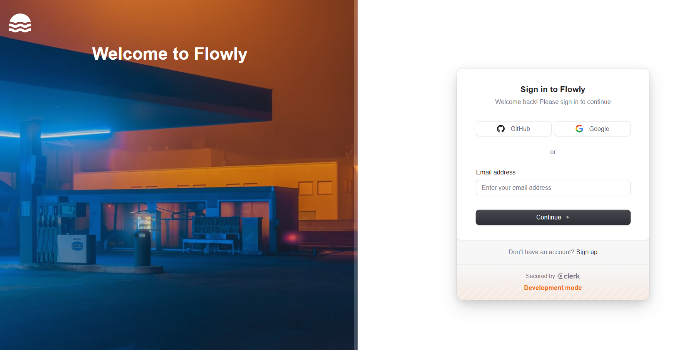
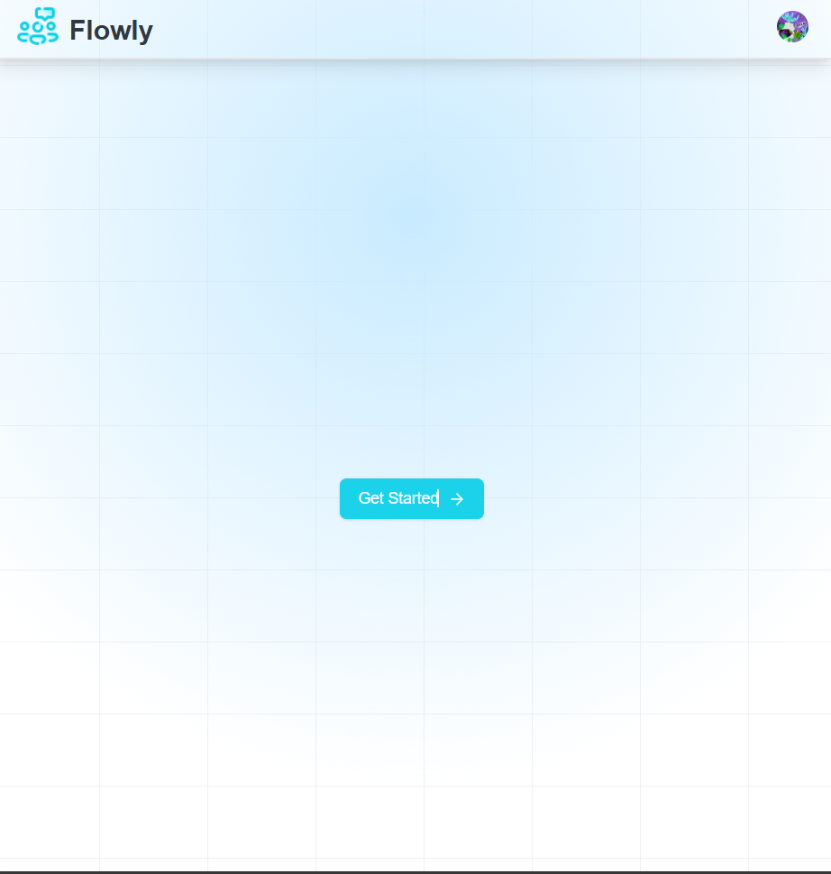
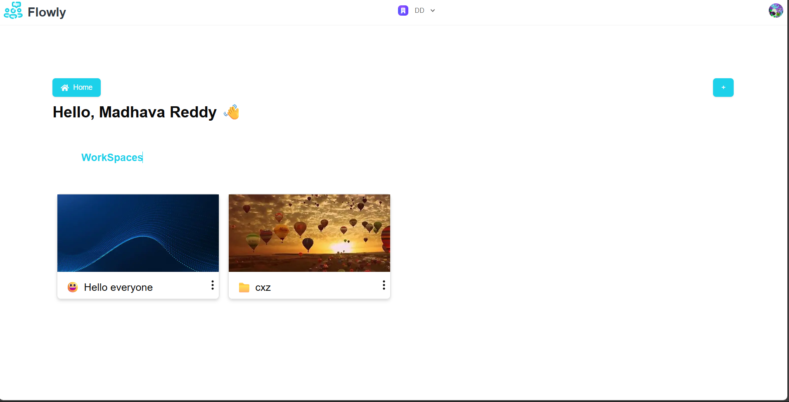
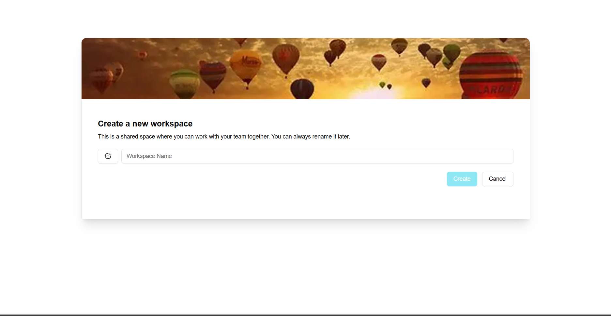
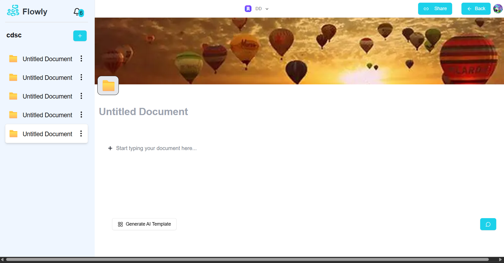
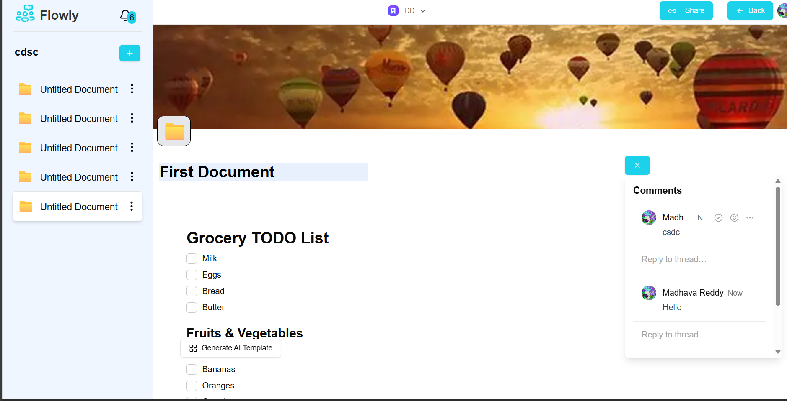
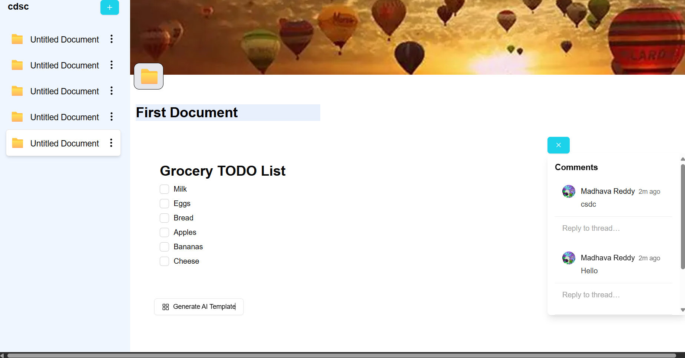
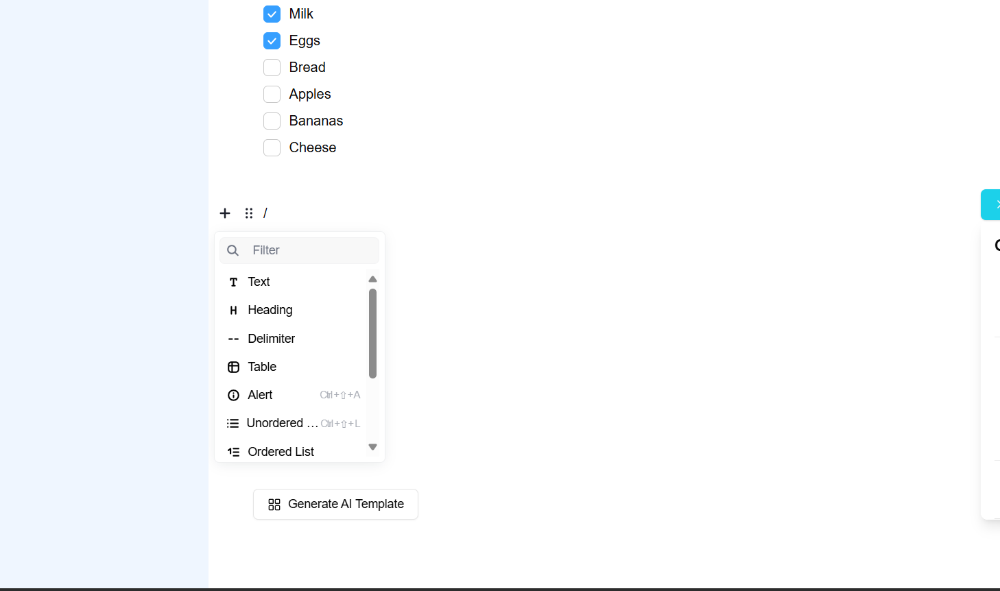

# 👋 Hello, Everyone!  
## 🚀 Introducing **Flowy** – A Collaborative Workspace

We’re excited to present **Flowy**, a powerful and seamless **collaborative workspace** built to elevate productivity, foster teamwork, and enable real-time collaboration.

---

## 📌 What is Flowy?

**Flowy** is a **modern collaborative platform** developed with:

- ⚛ **React & Next.js** – for a fast, interactive, and scalable frontend experience  
- 🟩 **Node.js** – for a robust and efficient backend ensuring smooth operations  

---

## 🎯 Why Choose Flowy?

In a world increasingly driven by **remote work** and **distributed teams**, Flowy is designed to help you:

✅ **Collaborate in Real-Time** – Work together with your team seamlessly  
✅ **Manage Tasks & Projects** – Stay organized and on track  
✅ **Ensure Data Security** – Your data is safe with us  
✅ **Enjoy an Intuitive UI/UX** – Simple, clean, and user-friendly  

---

## 🚀 Getting Started with Flowy

### 1️⃣ Login with Google or GitHub  

---

### 2️⃣ Click **Get Started**  

---

### 3️⃣ View Your Workspaces  
See all the workspaces you’ve created within your organization.  

---

### 4️⃣ Switch Organizations  
Easily change the active organization you're working in.  

---

### 5️⃣ Create a New Workspace  
Click the ➕ icon in the **Workspaces** tab.  
You'll be taken to a page where you can:  
- Name your workspace  
- Customize it with an **emoji** and **cover image**  

---

### 6️⃣ Access & Manage Workspace  
Once created, your workspace appears in the sidebar.  
- You can create up to **5 documents** per workspace  
- Delete or edit them anytime  

---

### 7️⃣ Chat with Team Members  
Click the 💬 icon in the bottom-right corner to open the chat.  
Collaborate with all workspace members.  

---

### 8️⃣ Stay Notified  
Check the 🔔 icon in the top-left to see notifications and unread messages.  

---

### 9️⃣ Generate Templates with AI  
Use **Gemini AI** to auto-generate templates.  
Just type a prompt like _“Grocery store todo list”_ and watch it create magic.  

---

### 🔤 Customize Your Text Editor  
Click `/` in the editor to access different text formatting options.  

---

## 💡 Summary

Flowy empowers your team to:

- 📁 Create and manage workspaces and documents  
- 💬 Chat and collaborate in real-time  
- 🔔 Stay informed with instant notifications  
- 🤖 Boost creativity with AI-generated templates  
- 🔐 Work securely and efficiently from anywhere

> ✨ **Start using Flowy today and experience a new era of collaboration!**

---

## 🛠 Tech Stack

- Frontend: **React.js, Next.js**  
- Backend: **Node.js, Express.js**  
- Database: **MongoDB**  
- Authentication: **Clerk (Google/GitHub OAuth)**  
- AI: **Gemini Integration**  
- Real-time: **WebSockets / Custom Events**

---

## 📄 License

This project is licensed under the [MIT License](LICENSE).

---

## 🙌 Contributing

We welcome contributions! Feel free to open issues or submit pull requests.

---

## 📫 Contact

For any questions or support, feel free to reach out:

- ✉️ Email: madhava2807@gmail.com  
- 🌐 Website: [Link](https://iflowly.netlify.app/)
